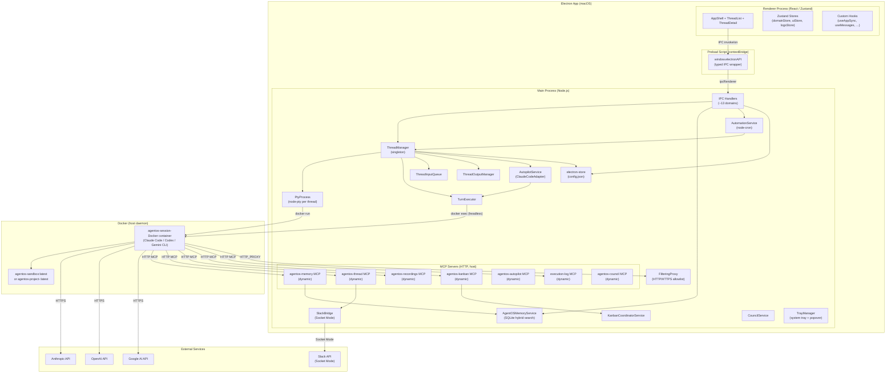
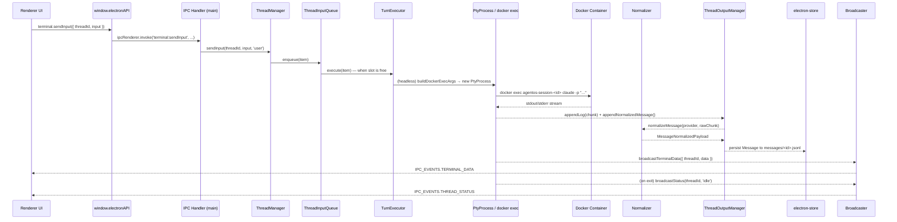
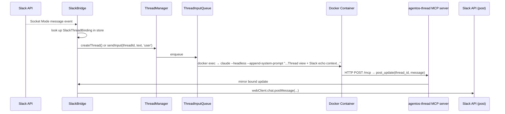

# AgentOS — Architecture Deep Dive

## Table of Contents

- [System Architecture Diagram](#system-architecture-diagram)
- [Component Catalog](#component-catalog)
- [Data Flow](#data-flow)
- [Design Patterns & Conventions](#design-patterns--conventions)
- [State Management](#state-management)
- [Error Handling Strategy](#error-handling-strategy)

---

## System Architecture Diagram

---

## Component Catalog

### Main Process

#### ThreadManager (`src/main/sessions/ThreadManager.ts`)

The central coordinator for all thread lifecycle operations. A singleton exported as `threadManager`.

**Purpose:** Creates, starts, stops, archives, and deletes threads; manages Docker container lifecycles; routes user input through the queue; broadcasts state changes to the renderer.

**Key responsibilities:**
- `createThread(req)` — allocates a git worktree (async, non-blocking; `git fetch` fires in the background with cached origin ref), resolves provider, persists to electron-store, broadcasts `THREAD_CREATED`
- `startThread(threadId)` — checks Docker, builds/pulls the sandbox image, builds Docker run args, creates a `PtyProcess`, sets up data/output streams
- `sendInput(threadId, input, source)` — enqueues input via `ThreadInputQueue`; supports interrupt-and-combine for headless turns
- `stopThread`, `deleteThread`, `archiveThread` — teardown with container cleanup
- `pruneContainers` — delegates to `ContainerManager`
- `setThreadAutopilot` — toggles autopilot on a thread and broadcasts status

**Internal dependencies:** `ThreadLifecycle`, `ThreadRuntimeStore`, `TurnExecutor`, `ThreadInputService` (send-input routing, enqueue policy, interrupt semantics, queue-depth broadcasting — extracted from ThreadManager), `ThreadOutputManager`, `ContainerManager`, `AutopilotService`, `TurnWaiterManager`, `CouncilChildThreadService` (council child thread spawning), `StageWorkerService` (Kanban stage worker thread spawning; shared PTY/log lifecycle via `EmbeddedChildThreadRunner`)

**External dependencies:** `electron-store`, `nanoid`, `strip-ansi`, Docker CLI (via `utils/docker/sandbox.ts` / `utils/docker/lifecycle.ts`)

---

#### PtyProcess (`src/main/sessions/PtyProcess.ts`)

A thin wrapper around `node-pty` that represents one running Docker container process (the initial `docker run` that starts the container).

**Key responsibilities:** Spawns and wraps a PTY, exposes `on('data')` and `on('exit')` events, provides `write(data)` and `kill()`, exposes PID.

---

#### TurnExecutor (`src/main/sessions/turnExecution.ts`)

Manages per-turn execution for both interactive (PTY) and headless (`docker exec`) modes, and handles narrow provider fallback cases.

**Key responsibilities:**
- `runTurn` — executes a single turn; mid-conversation provider failover has been removed (startup plain-text fallback within the same provider remains)
- `execHeadlessTurn` — delegates to `HeadlessRunner` (`src/main/sessions/headlessRunner.ts`, extracted from `turnExecution.ts`), which calls `readClaudeOauthToken()` before each turn and runs `docker exec` with the headless args; waits for the process to exit
- `execClaudeInteractiveTurn` — for `claude-interactive` threads, sends input to the long-lived PTY session and waits for the JSONL watcher to settle the turn
- `scheduleStartupInjection` — in interactive mode, injects the boot/memory prompt as the first message typed into the PTY
- Maintains `activeTurnProcs` (current `docker exec` processes) and `injectionStatuses`

---

#### ThreadInputQueue (`src/main/sessions/ThreadInputQueue.ts`)

A per-thread FIFO queue that serialises concurrent `sendInput` calls. By default, queued work waits indefinitely; automation and autopilot only use timeout-based dropping when `sendInput(..., { timeoutMs })` is explicitly provided.

---

#### ThreadOutputManager (`src/main/sessions/threadOutput.ts`)

Manages in-memory log buffers, appending to on-disk `.log` files, and persisting structured `Message` objects to per-thread JSONL files.

**Key responsibilities:**
- `appendLog` — appends raw ANSI bytes to the in-memory ring buffer (max 2000 entries) and the log file
- `appendNormalizedMessage` — calls the provider normalizer, persists a structured `Message` to `~/.agentos/messages/<threadId>.jsonl`
- `listMessages` — reads and parses the JSONL file
- `flushAssistantMessage` — finalises the in-progress assistant message accumulation

---

#### AutomationService (`src/main/automations/service.ts`)

Manages scheduled jobs using `node-cron` and `setTimeout`/`setInterval`.

**Key responsibilities:** `create`, `update`, `toggle`, `remove`, `runNow`; schedules cron/interval/one-shot timers; calls `executeRun` which creates a fresh automation thread, registers an assistant-response listener on `internalBus` before dispatching `threadManager.sendInput`, and records run counters/status back into the `AutomationJob` stored in electron-store.

**Trigger types:** `{ kind: 'manual' }` | `{ kind: 'schedule'; schedule: CronSchedule | EverySchedule | AtSchedule }`

---

#### AutopilotService (`src/main/autopilot/service.ts`)

After each assistant turn, inspects the conversation transcript via a secondary `docker exec` Claude invocation and decides the next user-behalf action.

**Key responsibilities:**
- `maybeRunAfterTurn(threadId, source)` — called by TurnExecutor after each turn
- Enforces `maxConsecutiveTurns` to prevent infinite loops
- Uses `ClaudeCodeAutopilotAdapter` which runs `docker exec` with a strict JSON system prompt and parses the response
- Three possible actions: `send_message`, `stop`, `noop`

---

#### AgentOSMemoryService (`src/main/memory/service.ts`)

Hybrid vector + keyword search over project markdown files and session JSONL logs.

**Key responsibilities:**
- `init(homeDir)` — initialises DB directory, sets up file watchers
- `search(params)` — lazy-syncs project files, runs cosine + BM25 query, applies temporal decay, applies MMR re-ranking, returns `MemorySearchHit[]`
- `save(params)` — writes to `<settings.memory.rootPath>/<projectId>/` markdown files (default root: `~/.agentos/memory/projects/`)
- `status`, `reindex`, `doctor` — diagnostics and forced re-indexing
- `get(params)` — reads a specific entry by ID or path

**Internal dependencies:** `schema.ts` (SCHEMA_SQL, SCHEMA_VERSION, EMBEDDING_DIMS), `vecSupport.ts` (sqlite-vec loading, checkVecTable, ensureVecTable), `projectDb.ts` (getProjectDb, DB cache lifecycle, runMigrations), `db.ts` (re-export shim for backwards compat), `MemoryStatsService` (projectStatsCache, expansionCountsCache), `MemoryContentService` (save/get/saveChunk/listChunks/delete/update/pin), `MemoryGraphService` (linkEntities, addObservation, graphQuery, graphAll, getEntityChunks), `MemorySyncCoordinator` (configure/warmup, watcher registry, search, reindex), `embeddings.ts`, `sync.ts`, `hybrid.ts`, `temporal-decay.ts`, `mmr.ts`, `embeddingCache.ts`, `memoryDiagnostics.ts`, `memoryGraphOps.ts`, `codeChunking.ts` (Tree-sitter code indexing)

---

#### SlackBridge (`src/main/integrations/slackBridge.ts`)

Connects to the Slack API using Socket Mode and routes inbound messages to thread input queues.

**Key responsibilities:** Starts/stops the Socket Mode client; starts the Slack MCP server whenever a bot token is available; processes `message` and `app_mention` events; tracks per-channel cursors for catch-up on restart; looks up or creates `SlackThreadBinding`s in electron-store; routes text to `threadManager.createThread` or `threadManager.sendInput`; optionally posts assistant and status updates back to Slack.

---

#### MCP Servers

| Server | File | Port | Tools exposed to agents |
|---|---|---|---|
| `agentos-memory` | `integrations/memoryMcpServer.ts` | dynamic (OS-assigned) | `memory_search`, `memory_get`, `memory_status`, `memory_save`, `memory_save_chunk`, `memory_link`, `memory_graph_query`, `memory_delete`, `memory_pin`, `memory_add_observation`, `memory_list_projects` |
| `agentos-thread` | `integrations/threadMcpServer.ts` | dynamic | `post_update`, `ask_clarification`, `upload_file`, `set_autopilot`, `update_personality`, `get_app_settings`, `update_app_settings`, `get_project_config`, `update_project_config`, `set_recording_title`, `list_project_messages`, `test_webhook` |
| `agentos-recordings` | `integrations/recordingsMcpServer.ts` | dynamic | `get_recording_meta`, `get_transcript`, `list_recordings`, `list_segments`, `get_window_transcript` |
| `agentos-kanban` | `kanban/mcpServer.ts` | dynamic | `get_task`, `list_tasks`, `move_task`, `archive_task`, `create_task`, `update_task`, `list_subtasks`, `update_progress`, `add_note`, `list_stages`, `update_stage`, `spawn_stage_worker`, `report_stage_result`, dependency and due-date tools |
| `execution-log` | `automations/executionLogMcpServer.ts` | dynamic | `log_execution` |
| `agentos-council` | `integrations/councilMcpServer.ts` | dynamic | `council_list_configs`, `council_upsert_config`, `council_dispatch`, `council_read_outcomes`, `council_await_completion` |
| `agentos-autopilot` | `integrations/autopilotMcpServer.ts` | dynamic | `get_transcript`, `submit_autopilot_decision` (planner-only) |

All servers use `@modelcontextprotocol/sdk` with a `StreamableHTTPServerTransport`.

**Port allocation:** MCP servers use OS-assigned ports (bound to `:0`). The actual port is resolved at thread-start time via `resolveMcpPort()` in `threadStartup.ts` and injected into the container's MCP client config. Thread-view messaging and Slack echoing now live on `agentos-thread`.

**Localhost auth bypass:** By default, requests to any MCP server from a loopback address (`127.0.0.1`, `::1`, `localhost`) skip bearer-token validation. This can be disabled by setting `AppSettings.mcpRequireAuth = true`.

---

#### FilteringProxy (`src/main/proxy/filteringProxy.ts`)

A lightweight HTTP server running in the AgentOS Node.js process that acts as a forward proxy for containers when `sandbox.allowedDomains` is set.

**Key responsibilities:**
- Handles CONNECT tunnel requests for HTTPS traffic — accepts or rejects based on the `allowedDomains` allowlist read live from settings.
- Handles plain HTTP requests — proxies allowed hosts, blocks others.
- Supports wildcard domain entries (e.g. `*.anthropic.com`).
- Injected into containers via `HTTP_PROXY`/`HTTPS_PROXY` environment variables in `buildDockerRunArgs`.
- Requires no container root, no `NET_ADMIN` capability, and no changes to the container image.

---

#### electron-store (`src/main/store/index.ts`)

Typed wrapper around `electron-store` with a fixed schema (`StoreSchema`). Exposes `getStore()` (lazy singleton) and `setSettings(patch)` with a `settingsEvents` EventEmitter for change propagation.

**Schema keys:** `threads`, `projects`, `automations`, `slackBindings`, `slackChannelCursors`, `settings`, `meta`, `kanbanCoordinators`

---

#### Kanban subsystem (`src/main/kanban/`)

Provides multi-agent project orchestration via a Kanban board.

| File | Role |
|---|---|
| `db.ts` | SQLite CRUD for `kanban_tasks`, `kanban_task_notes`, `kanban_wip_limits` (in the per-project memory DB) |
| `service.ts` | Business logic: `create`, `move`, `assign`, `updateProgress`, `addNote`, `setWipLimit`, `list` |
| `eventRouter.ts` | Listens to `kanban:taskMoved` internal bus events; routes transitions to the coordinator; prunes completed dev worktrees |
| `mcpServer.ts` | MCP server exposing task, stage, dependency, due-date, and stage-worker tools |
| `taskMain.ts` / `StageWorkerService.ts` | Spawns one stage worker thread at a time and routes `report_stage_result` back to the task main thread |

**Task statuses:** `backlog → researching → planning → implementing → reviewing → done` (plus `blocked` and `archived`). Stages are stored in the `kanban_stages` DB table and fully configurable per project. Task types (`dev | research | review | refine`) have been removed from the data model; all tasks are generic. The `saveToMemory` boolean on each stage replaces the old task-type-based auto-save.

**Task archiving:** Done tasks are auto-archived 5 days after completion. Any task can also be archived immediately via the `archive_task` MCP tool or the per-row action in list view. Archived tasks are hidden from board columns and appear in a collapsed list-view section.

**Coordinator and specialist threads:**

| Thread role | Behaviour |
|---|---|
| `coordinator` | Persistent; reads board, delegates tasks, moves pipeline; spawned per project |
| Stage worker | Spawned per task stage via `spawn_stage_worker`; reports result via `report_stage_result` |

---

#### Council subsystem (`src/main/council/`)

Provides multi-provider parallel dispatch via a named council configuration.

| File | Role |
|---|---|
| `service.ts` | `CouncilService`: spawns child sub-threads in parallel for each council member, deduplicates outcomes (first submission per child wins), kills the child process on submission, then dispatches a judge prompt to synthesize all outcomes |
| `src/main/mcp/councilMcpServer.ts` | `agentos-council` MCP server exposing `council_submit_outcome` tool to the coordinator/judge thread |

7 IPC channels support council CRUD (create, read, update, delete configs; list runs; read outcomes). Settings → Council tab (`CouncilDraftForm` component, `useCouncilConfigs` hook) provides the UI.

---

#### Normalizers (`src/main/normalizers/`)

Provider-specific output parsers that convert raw PTY/exec output into `MessageNormalizedPayload` (structured blocks: `text`, `thinking`, `tool_use`, `tool_result`).

| File | Provider | Input format |
|---|---|---|
| `claude.ts` | Claude Code | `stream-json` JSON lines or plain text |
| `codex/` | OpenAI Codex | JSON event stream — decomposed into per-event-family helpers in `src/main/normalizers/codex/` |
| `gemini.ts` | Google Gemini CLI | Plain text (parsed with heuristics) |

---

### Renderer Process

#### AppShell (`src/renderer/components/layout/AppShell.tsx`)

Root layout component: renders `TitleBar`, a collapsible sidebar (`ThreadList` + `AutomationsPanel`), and the main content area (`ThreadDetail` or `NewThreadComposer`). Also renders the `MeetingPanel` overlay. Owns Docker availability check on startup.

`NewThreadComposer` is the new-thread creation UI. It supports file attachments (paperclip button, wired to `useAttachedFiles` hook shared with `PromptInput`) and provider/worktree selection. The `.agentos/config.json` advanced options panel was removed from thread creation; those settings are now only managed through project config directly.

#### ThreadDetail (`src/renderer/components/threads/ThreadDetail.tsx`)

The main per-thread view. Contains `MessageList`, `TerminalPane`, `MemoryPanel`, `WikiPanel`, and the `PromptInput` composer. Memory and Graph are now promoted to **top-level navigation tabs** in the application shell, making them accessible independently of the thread detail view.

#### BoardView (`src/renderer/components/board/BoardView.tsx`)

The Kanban board UI for a project. Renders either `BoardColumn` components (kanban view) or `BoardListView` (list view), toggled from `CoordinatorBar`. Visible on `ProjectDetail` when `kanban.enabled` is true. Backed by `boardStore` (Zustand). Wrapped in `CardPrefsProvider` for per-project display preference state.

**Key board components:**

| Component | Description |
|---|---|
| `BoardColumn` | Column for one task status; WIP fraction; blocked column support |
| `ExpediteLane` | Fixed swimlane above all columns for `expedite` class-of-service tasks |
| `TaskCard` | Redesigned card (Linear+Multica style): priority badge, due-date chip, subtask progress badge, agent avatar, live-execution indicator, selection checkbox |
| `PriorityPicker` | Inline priority popover on the card |
| `DueDatePicker` | Inline due-date picker (local-timezone parsing) |
| `AgentAssignPicker` | Inline agent-assignment picker |
| `CardPrefsContext` | Context + hook for 10 boolean card display prefs persisted in localStorage |
| `DisplayOptionsPopover` | Display popover in CoordinatorBar with 8 card-field + 2 column-field toggles |
| `BoardListView` | Linear-style table list view of all tasks |
| `BatchActionBar` | Sticky bar for multi-select bulk actions (move, assign, delete) |
| `TaskSlideOver` | Two-column sheet detail with redesigned activity timeline |
| `CoordinatorBar` | Header with view switcher (board/list) and Display popover |

#### MeetingRecorder / MeetingPanel (`src/renderer/components/meetings/`)

`MeetingRecorder` captures microphone audio via Web Audio API, encodes PCM chunks as 16-bit mono WAV, sends the buffer to `audio:transcribe`, and feeds the transcript to a Claude thread with a structured notes template. `MeetingPanel` wraps `MeetingRecorder` in a slide-over panel accessible from `AppShell`.

#### useAppSync (`src/renderer/hooks/useAppSync.ts`)

Runs once on mount; fetches initial threads, logs, and automations; subscribes to all IPC events (`threadStatus`, `terminalData`, `logEntry`, `messageAppended`, `threadRenamed`, `threadCreated`); drives TTS playback for new assistant messages.

---

### Preload Script (`src/preload/index.ts`)

Uses `contextBridge.exposeInMainWorld('electronAPI', api)` to give the renderer a type-safe API object. All IPC calls go through the typed `invoke<K>` wrapper which unwraps `{ ok, data, error }` response envelopes.

---

## Data Flow

### User sends a message

### Slack message arrives

---

## Design Patterns & Conventions

| Pattern | Where it appears |
|---|---|
| **Singleton service** | `threadManager`, `automationService`, `agentOSMemoryService`, `slackBridge` — each module exports a single pre-constructed instance |
| **Command queue (FIFO)** | `ThreadInputQueue` serialises concurrent sendInput calls; queue drops only happen when an explicit timeout is supplied |
| **Observer / EventEmitter** | `PtyProcess.on('data')`, `PtyProcess.on('exit')`; `settingsEvents.on('change')` |
| **Strategy pattern** | Provider normalizers (`claude.ts`, `codex.ts`, `gemini.ts`) registered in a map; `AutopilotAdapter` interface with `ClaudeCodeAutopilotAdapter` implementation |
| **contextBridge / facade** | `preload/index.ts` exposes a typed API surface; renderer never calls `ipcRenderer` directly |
| **Typed IPC registry** | `src/shared/ipc/registry.ts` (`IPCMap`) enforces input/output types for every channel at compile time |
| **Factory function** | `getStore()` lazily instantiates electron-store once; `getProjectDb(projectId)` lazily opens and caches SQLite connections |
| **Separation of concerns (DI-style)** | `TurnExecutor` receives accessor callbacks instead of holding direct references to PTY maps owned by `ThreadManager`, making ownership boundaries explicit |
| **Broadcast / push events** | `broadcaster.ts` functions (`broadcastTerminalData`, `broadcastStatus`, etc.) use `BrowserWindow.getAllWindows()[0].webContents.send(channel, payload)` to push events to the renderer |

---

## State Management

### Main process

State lives in two places:

1. **electron-store** — persisted to disk in Electron's user-data directory, or under `AGENTOS_STORE_DIR` when set. Keys: `threads`, `projects`, `automations`, `slackBindings`, `slackChannelCursors`, `settings`, `meta`. All writes go through `getStore().set(key, value)`.
2. **In-memory runtime state** — ephemeral data not written to disk: PTY instances (`ThreadManager.ptys`), launch modes, input queues, in-progress output accumulation, container watcher handles.

Settings changes emit `settingsEvents.emit('change', updated)` so that services like `AgentOSMemoryService` can react to configuration changes without polling.

### Renderer process

Three Zustand stores:

| Store | File | Contents |
|---|---|---|
| `useDomainStore` | `store/domainStore.ts` | `threads: Record<string, Thread>`, `automations: AutomationJob[]`; mutated by IPC events |
| `useUIStore` | `store/uiStore.ts` | `selectedThreadId`, `threadFilter`, `sandboxBuildProgress` — purely UI state |
| `useLogsStore` | `store/logsStore.ts` | `logs: AppLogEntry[]` — ring buffer of app event log entries |
| `useBoardStore` | `store/boardStore.ts` | `tasks: KanbanTask[]`, `wipLimits`, board loading/mutation state; poll-based via `usePollData` |

The `useAppSync` hook wires IPC events to store mutations on mount. Components consume stores via Zustand selectors.

---

## Error Handling Strategy

### Main process

- **IPC handlers** wrap every handler body in a `try/catch` and return `{ ok: false, error: message }` on failure. The preload's `unwrap()` function throws a JavaScript `Error` in the renderer on non-ok responses.
- **ThreadManager** catches errors from `startThread`, `stopThread`, and per-turn execution and updates the thread's `status` to `'error'` in the store before broadcasting. Errors are also written to the event log.
- **EventLogger** (`src/main/utils/eventLog.ts`) provides `debug`, `info`, `warn`, `error` methods. Entries are stored in a ring buffer (also persisted to `~/.agentos/eventlog.jsonl` when `persistDebugLogs` is true) and broadcast to the renderer as `IPC_EVENTS.LOG_ENTRY` events.
- **Automation runner** wraps `executeRun` in try/catch; it must subscribe to `message:appended` before awaiting `sendInput()` because `sendInput()` resolves only after the turn has flushed its assistant message. `markRun(id, 'error', message)` records failures such as the 5-minute response timeout, and the job remains scheduled for the next interval.
- **Provider fallback** is now narrow: mid-conversation provider failover has been removed; startup can still fall back from stream-JSON to plain Claude output inside the same provider when needed.

### Renderer process

- Async operations inside hooks use `.catch(err => console.warn(...))` to prevent unhandled promise rejections from crashing the renderer.
- UI components display error state from thread status (e.g., `status === 'error'`) via `ThreadStatusBadge`.
- No global error boundary is present — individual component errors surface as React error boundaries if added, or as console errors.
