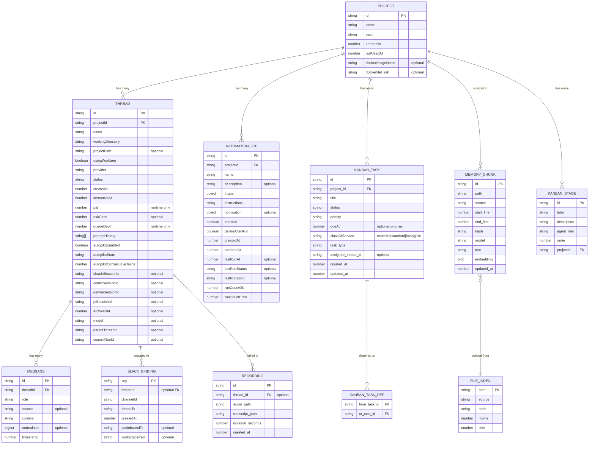

# AgentOS — Data Model & Storage

## Table of Contents

- [Entity-Relationship Diagram](#entity-relationship-diagram)
- [electron-store Schema](#electron-store-schema)
  - [threads](#threads)
  - [projects](#projects)
  - [automations](#automations)
  - [settings](#settings)
  - [slackBindings](#slackbindings)
  - [slackChannelCursors](#slackchannelcursors)
- [File-based Storage](#file-based-storage)
  - [Thread log files](#thread-log-files)
  - [Thread message files (JSONL)](#thread-message-files-jsonl)
  - [Session data directory](#session-data-directory)
  - [Memory markdown files](#memory-markdown-files)
  - [Wiki pages](#wiki-pages)
  - [Event log](#event-log)
- [Memory SQLite Database](#memory-sqlite-database)
  - [Schema](#schema)
  - [Indexes](#indexes)
  - [Virtual tables](#virtual-tables)
  - [Embedding dimensions](#embedding-dimensions)
- [Container Registry SQLite Database](#container-registry-sqlite-database)
- [Caching Strategy](#caching-strategy)
- [Migrations](#migrations)

---

## Entity-Relationship Diagram



---

## electron-store Schema

The main persistent store is a JSON file managed by `electron-store` at:
- macOS: `~/Library/Application Support/agentos/config.json`
- Linux: `~/.config/agentos/config.json`

Override with the `AGENTOS_STORE_DIR` environment variable (used in tests).

### threads

`Record<string, Thread>` — maps thread ID to thread state.

| Field | Type | Notes |
|---|---|---|
| `id` | `string` | nanoid (21 chars) |
| `name` | `string` | User-visible name |
| `projectId` | `string` | References `projects[id]` |
| `workingDirectory` | `string` | Absolute path (worktree path or project root) |
| `projectPath` | `string?` | Canonical project root (set when worktree is used) |
| `usingWorktree` | `boolean` | True when a git worktree was created |
| `provider` | `'claude' \| 'codex' \| 'gemini'` | Defaults to `'claude'` on migration |
| `status` | `ThreadStatus` | `running/idle/error/stopped/archived`; normalised to `stopped` on load |
| `createdAt` | `number` | Unix ms |
| `lastActiveAt` | `number` | Unix ms; updated on each user input |
| `pid` | `number?` | PID of `docker run` process; not persisted across restarts |
| `exitCode` | `number?` | Last exit code |
| `queueDepth` | `number?` | Count of pending items in input queue; not persisted |
| `promptHistory` | `string[]` | Last 100 user input strings |
| `autopilotEnabled` | `boolean?` | Whether autopilot is active |
| `autopilotState` | `AutopilotThreadState?` | `idle/thinking/sent/stopped/blocked` |
| `autopilotLastReason` | `string?` | Human-readable last autopilot decision |
| `autopilotConsecutiveTurns` | `number?` | Counter reset when a human sends input |
| `claudeSessionId` | `string?` | Persisted Claude `session_id` for `--resume` |
| `codexSessionId` | `string?` | Persisted Codex `thread_id` for resume |
| `geminiSessionId` | `string?` | Persisted Gemini session ID for resume |
| `archivedAt` | `number?` | Unix ms; set when archived; causes thread to be hidden |

**Indexes:** None (electron-store is a flat JSON object; lookups by ID are O(1) via `threads[id]`).

---

### projects

`Record<string, SavedProject>` — maps project ID to project metadata.

| Field | Type | Notes |
|---|---|---|
| `id` | `string` | nanoid |
| `name` | `string` | Derived from the directory name |
| `path` | `string` | Absolute path to the project root |
| `createdAt` | `number` | Unix ms |
| `lastUsedAt` | `number` | Unix ms; updated when a new thread is created |
| `dockerImageName` | `string?` | `agentos-project-<id>:latest`; set after first Docker image build |
| `dockerfileHash` | `string?` | SHA256 of `Dockerfile.agentos` at build time; used to detect Dockerfile changes |

---

### automations

`Record<string, AutomationJob>` — maps automation ID to job definition.

| Field | Type | Notes |
|---|---|---|
| `id` | `string` | nanoid |
| `name` | `string` | |
| `description` | `string?` | |
| `projectId` | `string` | References `projects[id]` |
| `trigger` | `AutomationTrigger` | `{ kind: 'manual' }` or `{ kind: 'schedule'; schedule: AutomationSchedule }` |
| `instructions` | `string` | The text sent to the thread when the automation fires |
| `notification` | `AutomationNotification?` | Slack notification on success or failure |
| `enabled` | `boolean` | Whether the schedule is active |
| `deleteAfterRun` | `boolean` | If true, the job is removed after it runs once |
| `createdAt` | `number` | Unix ms |
| `updatedAt` | `number` | Unix ms |
| `lastRunAt` | `number?` | Unix ms of most recent execution |
| `lastRunStatus` | `'ok' \| 'error' \| 'skipped'?` | |
| `lastRunError` | `string?` | Error message from last failed run |
| `runCountOk` | `number` | Cumulative successful runs |
| `runCountError` | `number` | Cumulative failed runs |

`AutomationSchedule`:
- `{ kind: 'cron'; expr: string }` — standard 5-field cron expression
- `{ kind: 'every'; ms: number }` — interval in milliseconds (minimum 1000)
- `{ kind: 'at'; iso: string }` — one-shot ISO 8601 timestamp

---

### settings

`AppSettings` — a single flat object. See [Shared Types Reference](./03-api-reference.md#appsettings) for the full shape.

**Security:** API keys (`settings.apiKeys.*`) are encrypted at rest via `electron.safeStorage` (serialize/deserialize hooks in `electron-store`). The values stored on disk are encrypted blobs; they are decrypted in-memory at read time. This is a P0 storage hardening measure introduced in storage hardening work (#517).

**Cascade deletes:** Deleting a thread removes its associated `session_metrics` and `automation_runs` rows. Deleting a project cascades through all its threads and then drops the project's analytics and memory SQLite files from disk.

Notable defaults (set in `src/main/store/index.ts`):

| Setting | Default |
|---|---|
| `claudeStreamJson` | `true` |
| `skipPermissions` | `true` (passes `--dangerously-skip-permissions` to Claude) |
| `maxLogBufferSize` | `2000` |
| `theme` | `'dark'` |
| `fontSize` | `14` |
| `embeddingProvider` | `'local'` |
| `failover.enabled` | `true` |
| `failover.transcriptMessages` | `12` |
| `containerPrune.idleHours` | `24` |
| `containerPrune.maxAgeDays` | `7` |
| `autopilot.enabled` | `false` |
| `autopilot.maxConsecutiveTurns` | `10` |
| `autopilot.transcriptMessages` | `25` |

---

### slackBindings

`Record<string, SlackThreadBinding>` — maps a composite key (`<channelId>:<threadTs>`) to a binding record.

| Field | Type | Notes |
|---|---|---|
| `key` | `string` | `<channelId>:<threadTs>` |
| `threadId` | `string?` | AgentOS thread ID this Slack thread is bound to |
| `channelId` | `string` | Slack channel ID |
| `threadTs` | `string` | Slack thread timestamp |
| `createdAt` | `number` | Unix ms |
| `lastInboundTs` | `string?` | Slack message timestamp of last inbound message |
| `workspacePath` | `string?` | Project directory for new thread creation |

---

### slackChannelCursors

`Record<string, string>` — maps a Slack channel ID to the latest seen message timestamp for restart catch-up.

| Field | Type | Notes |
|---|---|---|
| `<channelId>` | `string` | Slack `ts` cursor for the watched channel |

---

### kanbanCoordinators

`Record<string, string>` — maps project ID to the thread ID of that project's persistent Kanban coordinator thread.

| Field | Type | Notes |
|---|---|---|
| `<projectId>` | `string` | Thread ID of the coordinator thread; cleared if the thread is deleted |

---

## File-based Storage

All file-based storage lives under `~/.agentos/` (or `$HOME/.agentos/`).

```
~/.agentos/
├── logs/
│   └── <threadId>.log         # Raw ANSI log file (append-only)
├── messages/
│   └── <threadId>.jsonl       # Structured messages (one JSON object per line)
├── sessions/
│   └── <threadId>/            # Per-thread session data directory
│       ├── .codex/            # Codex auth files seeded from host
│       └── .gemini/           # Gemini auth files seeded from host
├── memory/
│   └── projects/
│       └── <projectId>.sqlite # Per-project memory + kanban DB
├── projects/
│   └── projects.sqlite        # Global projects + threads + kanban + recordings DB (src/main/threads/db.ts)
└── eventlog.jsonl             # App event log (when persistDebugLogs = true)
```

Additionally, per-project memory markdown files live at:
```
<memoryRootPath>/<projectId>/
├── MEMORY.md                  # Top-level memory file
└── memory/
    └── *.md                   # Additional topic memory files
```
`memoryRootPath` defaults to `~/.agentos/memory/projects` (set in settings).

---

### Thread log files

- **Path:** `~/.agentos/logs/<threadId>.log`
- **Format:** Raw ANSI bytes, append-only.
- **Retention:** Deleted when the thread is deleted. Archived threads retain the log file.
- **In-memory buffer:** Last 2000 entries (configurable via `maxLogBufferSize`) are kept in `ThreadOutputManager`'s ring buffer. On startup, the last 512 KB of each log file is preloaded into the buffer.

---

### Thread message files (JSONL)

- **Path:** `~/.agentos/messages/<threadId>.jsonl`
- **Format:** One `Message` JSON object per line.
- **Retention:** Deleted when the thread is deleted (via `messages:clear` or thread deletion). Cleared programmatically via `messages:clear`.
- **Session IDs:** Claude's `session_id` is extracted from stream-json output and persisted to `threads.<id>.claudeSessionId` in electron-store for `--resume` support.

---

### Session data directory

- **Path:** `~/.agentos/sessions/<threadId>/`
- **Contents:** Per-provider auth files copied/seeded from the host for Codex (`~/.codex/auth.json`) and Gemini (`~/.gemini/`). These are mounted into Docker containers at the same path inside the `agent` user's home.

---

### Memory markdown files

- **Path:** `<memoryRootPath>/<projectId>/MEMORY.md` and `<memoryRootPath>/<projectId>/memory/*.md`
- **Format:** Plain markdown.
- **Written by:** `memory:save` IPC call (from UI or from agents via the `agentos-memory` MCP server's `memory_save` tool).
- **Indexed by:** `AgentOSMemoryService.sync()` — chunked, embedded, and written to the project SQLite DB.

---

### Wiki pages

- **Path:** `<projectPath>/wiki/<pageId>.md`
- **Format:** Markdown file with frontmatter (`id`, `title`, `createdAt`, `updatedAt`) followed by page content.
- **Managed by:** `wiki:*` IPC handlers in `src/main/ipc/handlers/wikiHandlers.ts`.

---

### Event log

- **Path:** `~/.agentos/eventlog.jsonl`
- **Written when:** `settings.persistDebugLogs = true`.
- **Format:** `AppLogEntry` JSON objects, one per line.

---

## Memory SQLite Database

Each project gets its own SQLite file at `~/.agentos/memory/projects/<projectId>.sqlite`. The database is opened with WAL mode and `NORMAL` synchronous setting for performance. This same database also stores Kanban board data for the project (see [Kanban tables](#kanban-tables) below).

### Schema

```sql
-- Schema version tracking
CREATE TABLE meta (
  key   TEXT PRIMARY KEY,
  value TEXT NOT NULL
);

-- File tracking (used to detect changes during re-sync)
CREATE TABLE files (
  path   TEXT PRIMARY KEY,
  source TEXT NOT NULL DEFAULT 'memory',  -- 'memory' or 'sessions'
  hash   TEXT NOT NULL,                   -- SHA256 of file content
  mtime  INTEGER NOT NULL,                -- file modification time (ms)
  size   INTEGER NOT NULL
);

-- Text chunks with optional embeddings
CREATE TABLE chunks (
  id         TEXT PRIMARY KEY,             -- nanoid
  path       TEXT NOT NULL,               -- relative path (e.g. 'MEMORY.md', 'sessions/<id>.jsonl')
  source     TEXT NOT NULL DEFAULT 'memory',
  start_line INTEGER NOT NULL,
  end_line   INTEGER NOT NULL,
  hash       TEXT NOT NULL,               -- SHA256 of chunk text (for dedup)
  model      TEXT NOT NULL,               -- embedding model name (or 'fts-only')
  text       TEXT NOT NULL,
  embedding  TEXT NOT NULL DEFAULT '[]',  -- JSON float array (legacy; real embeddings in chunks_vec)
  updated_at INTEGER NOT NULL             -- unix ms
);

-- Embedding cache (avoid re-computing embeddings for unchanged text)
CREATE TABLE embedding_cache (
  provider     TEXT NOT NULL,
  model        TEXT NOT NULL,
  provider_key TEXT NOT NULL,
  hash         TEXT NOT NULL,
  embedding    TEXT NOT NULL,
  dims         INTEGER,
  updated_at   INTEGER NOT NULL,
  PRIMARY KEY (provider, model, provider_key, hash)
);

-- FTS5 virtual table for keyword search
CREATE VIRTUAL TABLE chunks_fts USING fts5(
  text, id UNINDEXED, path UNINDEXED, source UNINDEXED,
  model UNINDEXED, start_line UNINDEXED, end_line UNINDEXED
);

-- Vector search virtual table (created by sqlite-vec extension)
-- Dimension count matches the embedding provider; re-created when provider changes
CREATE VIRTUAL TABLE chunks_vec USING vec0(
  id TEXT,
  embedding FLOAT[<dims>]
);
```

### Indexes

| Index | Table | Column | Rationale |
|---|---|---|---|
| `idx_chunks_path` | `chunks` | `path` | Fast lookup by file path during sync (checking if chunk is stale) |
| `idx_chunks_source` | `chunks` | `source` | Filter by `memory` vs `sessions` source |
| `idx_embedding_cache_updated_at` | `embedding_cache` | `updated_at` | Supports LRU-style cache pruning |

### Virtual tables

- **`chunks_fts`** — FTS5 full-text search on chunk text. Queried with BM25 ranking via `bm25(chunks_fts)`.
- **`chunks_vec`** — sqlite-vec extension virtual table for cosine similarity search. Created only when sqlite-vec is available and an embedding provider is configured.

### Embedding dimensions

The `vec_dims` meta key stores the dimension count of the current embedding provider. When the provider changes (different dimensions), the `chunks_vec` table is dropped and recreated to match the new dimension count.

Typical dimensions:
| Provider | Model | Dims |
|---|---|---|
| OpenAI | `text-embedding-3-small` | 1536 |
| Google | `embedding-001` | 768 |
| Voyage | `voyage-3-lite` | 512 |
| Mistral | `mistral-embed` | 1024 |
| Local (node-llama-cpp) | depends on model | varies |

### Kanban tables

Kanban board data shares the per-project SQLite database. The tables are created on first access via `getProjectDb()`. Schema version 11 added the `kanban_stages` table; schema version 16 added `due_at` and `class_of_service` columns; schema version 17 added the `kanban_task_deps` table. Current schema version: **17**.

```sql
-- Kanban tasks
CREATE TABLE IF NOT EXISTS kanban_tasks (
  id                TEXT PRIMARY KEY,
  project_id        TEXT NOT NULL,
  title             TEXT NOT NULL,
  description       TEXT NOT NULL DEFAULT '',
  status            TEXT NOT NULL DEFAULT 'refinement',
  priority          TEXT NOT NULL DEFAULT 'medium',
  progress          INTEGER NOT NULL DEFAULT 0,
  assigned_thread_id TEXT,
  skill_tags        TEXT NOT NULL DEFAULT '[]',  -- JSON array
  branch            TEXT,
  worktree_path     TEXT,
  task_type         TEXT NOT NULL DEFAULT 'dev',
  parent_task_id    TEXT,
  due_at            INTEGER,                      -- unix ms; NULL = no due date (schema v16)
  class_of_service  TEXT NOT NULL DEFAULT 'standard', -- 'expedite'|'standard'|'intangible' (schema v16)
  created_at        INTEGER NOT NULL,
  updated_at        INTEGER NOT NULL,
  completed_at      INTEGER,
  metadata          TEXT NOT NULL DEFAULT '{}'   -- JSON object
);

-- Notes attached to tasks (agent reasoning, review findings)
CREATE TABLE IF NOT EXISTS kanban_task_notes (
  id         TEXT PRIMARY KEY,
  task_id    TEXT NOT NULL,
  thread_id  TEXT,
  content    TEXT NOT NULL,
  created_at INTEGER NOT NULL
);

-- WIP limits per pipeline stage
CREATE TABLE IF NOT EXISTS kanban_wip_limits (
  project_id TEXT NOT NULL,
  status     TEXT NOT NULL,
  max_tasks  INTEGER NOT NULL,
  PRIMARY KEY (project_id, status)
);

-- Pipeline stage definitions (schema v11)
CREATE TABLE IF NOT EXISTS kanban_stages (
  id         TEXT PRIMARY KEY,
  project_id TEXT NOT NULL,
  label      TEXT NOT NULL,
  description TEXT NOT NULL DEFAULT '',
  agent_role TEXT NOT NULL DEFAULT '',
  "order"    INTEGER NOT NULL DEFAULT 0
);
-- Default stages seeded per-project: refining → implementing → reviewing → done

-- Inter-task dependency graph (schema v17)
CREATE TABLE IF NOT EXISTS kanban_task_deps (
  from_task_id TEXT NOT NULL,
  to_task_id   TEXT NOT NULL,
  PRIMARY KEY (from_task_id, to_task_id),
  FOREIGN KEY (from_task_id) REFERENCES kanban_tasks(id) ON DELETE CASCADE,
  FOREIGN KEY (to_task_id)   REFERENCES kanban_tasks(id) ON DELETE CASCADE
);
```

### Recordings table

Meeting recordings are stored in the global projects/threads SQLite database at `~/.agentos/projects/projects.sqlite` (`src/main/threads/db.ts`), not in the per-project memory DB:

```sql
CREATE TABLE IF NOT EXISTS recordings (
  id               TEXT PRIMARY KEY,
  thread_id        TEXT,           -- linked AgentOS thread (created after transcription)
  audio_path       TEXT NOT NULL,  -- path to saved WAV file on host
  transcript_path  TEXT NOT NULL,  -- path to transcript text file on host
  duration_seconds REAL NOT NULL,
  created_at       INTEGER NOT NULL
);
CREATE INDEX IF NOT EXISTS idx_recordings_thread_id ON recordings(thread_id);
```

The `recordings` table also drives a v3→v4 migration that adds a `recording_id` column to the `threads` table, linking each thread back to its originating recording for reverse lookup.

---

## Container Registry SQLite Database

A separate SQLite database tracks Docker container metadata for pruning decisions.

- **Path:** `~/.agentos/containers.sqlite`
- **Managed by:** `src/main/utils/containerRegistry.ts`

```sql
CREATE TABLE containers (
  container_name   TEXT PRIMARY KEY,
  thread_id        TEXT NOT NULL,
  created_at_ms    INTEGER NOT NULL,
  last_used_at_ms  INTEGER NOT NULL,
  image            TEXT NOT NULL,
  config_hash      TEXT NOT NULL     -- hash of container config; used to detect drift
);
```

Pruning logic: containers where `last_used_at_ms < (now - idleHours * 3600 * 1000)` or `created_at_ms < (now - maxAgeDays * 86400 * 1000)` are removed.

---

## Caching Strategy

| What | Where | TTL / Invalidation |
|---|---|---|
| Thread log buffer | In-memory ring buffer in `ThreadOutputManager` | Lost on app restart; preloaded from disk (last 512 KB) on startup |
| Memory sync state | `AgentOSMemoryService.syncedProjects` Set | Invalidated when `settings.memoryRootPath` / `extraMemoryPaths` changes or file watcher fires |
| Embedding cache | `embedding_cache` SQLite table (per-project DB) | Never pruned automatically; same text+model always produces same embedding |
| Project DB handles | `dbCache` Map in `db.ts` | Closed on `invalidateProject()`; reopened on next access |
| Claude OAuth token | In-process `cachedToken` in `threadAuth.ts` | Refreshed automatically when within 5 min of expiry; falls back to Keychain read |

---

## Migrations

### electron-store

AgentOS does not run formal database migrations on the electron-store JSON. Instead, `ThreadManager.loadFromStore()` applies inline migrations:

- **Provider migration:** Threads without a `provider` field are given `provider: 'claude'` on load.
- **Status normalisation:** All threads are set to `status: 'stopped'` on startup (no thread should be in `'running'` state at cold-start).
- **Invalid thread pruning:** Threads failing `isValidStoredThread()` validation are silently dropped and a warning is logged.

### Memory SQLite

The `meta.schema_version` key tracks the schema. Schema version 11 added the `kanban_stages` table; schema version 16 added `due_at` and `class_of_service` columns to `kanban_tasks`; schema version 17 added the `kanban_task_deps` table. Current version: **17**. Migrations are handled in `getProjectDb()` by comparing the stored version against the expected version and running ALTER TABLE or data migrations.

When the embedding provider's dimensions change, `ensureVecTable()` drops and recreates `chunks_vec` automatically — this is a runtime migration, not a schema version change.
