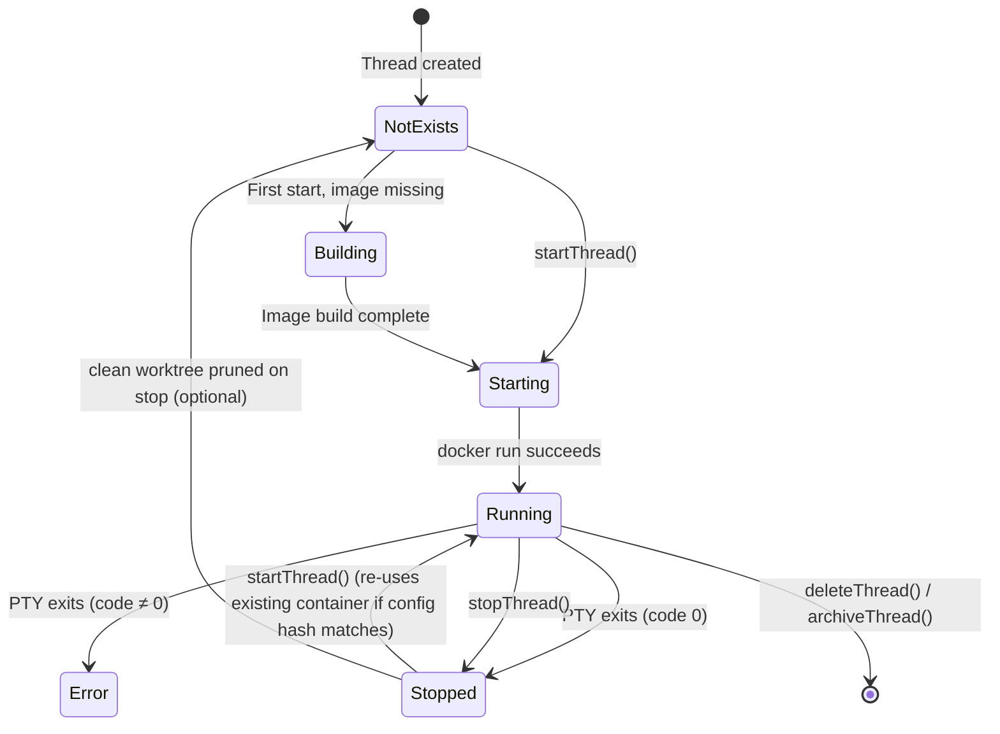

# AgentOS — Configuration & Infrastructure

## Table of Contents

- [Environment Variables](#environment-variables)
- [Config Files](#config-files)
- [Deployment Architecture](#deployment-architecture)
- [CI/CD Pipeline](#cicd-pipeline)
- [Docker Sandbox](#docker-sandbox)
- [Monitoring & Observability](#monitoring--observability)
- [Security Considerations](#security-considerations)

---

## Environment Variables

These variables affect the running AgentOS process. None are required for normal development; they all have working defaults.

| Variable | Required | Default | Description |
|---|---|---|---|
| `AGENTOS_STORE_DIR` | No | OS user-data dir | Override the directory for `electron-store`'s `config.json`. Primarily used in tests to isolate state. |
| `AGENTOS_OPEN_DEVTOOLS` | No | `0` | Set to `1` to automatically open Chromium DevTools when AgentOS starts in development mode. |
| `CLAUDE_CODE_OAUTH_TOKEN` | No | Read from macOS Keychain | When set, AgentOS injects this value into Docker containers as-is instead of reading from the Keychain. Useful in CI or non-macOS environments. |
| `CSC_NAME` | No | — | Code-signing identity for macOS packaging (e.g. `Developer ID Application: ...`). |
| `APPLE_ID` | No | — | Apple ID for notarization. |
| `APPLE_APP_SPECIFIC_PASSWORD` | No | — | App-specific password for notarization. |
| `APPLE_TEAM_ID` | No | — | Apple Developer Team ID for notarization. |
| `TS_AUTHKEY` | No | — | Tailscale auth key; if set in `AppSettings.tailscale.authKey`, passed into Docker containers to join the Tailscale network. |

### Variables injected into Docker containers

These are set programmatically by `buildDockerRunArgs` and are not host environment variables:

| Variable | Source | Description |
|---|---|---|
| `CLAUDE_CODE_OAUTH_TOKEN` | Keychain | OAuth access token for Claude Code |
| `ANTHROPIC_API_KEY` | Settings `apiKeys.anthropic` | API key if Keychain auth not used |
| `OPENAI_API_KEY` | Settings `apiKeys.openai` | API key for Codex |
| `GOOGLE_API_KEY` | Settings `apiKeys.google` | API key for Gemini |
| `AGENTOS_PROJECT_ID` | Thread metadata | Passed when memory MCP is enabled |
| `AGENTOS_THREAD_ID` | Thread metadata | Passed when memory MCP is enabled |
| `SLACK_CHANNEL_ID` | Slack context | Injected when thread was started from Slack |
| `SLACK_THREAD_TS` | Slack context | Injected when thread was started from Slack |
| `GH_TOKEN` | Settings `apiKeys.github` | GitHub personal access token (if configured) |
| `TS_AUTHKEY` | Settings `tailscale.authKey` | Tailscale auth key (if configured) |
| `TS_HOSTNAME` | Thread ID | `agentos-<threadId[:8]>` |
| `TS_FUNNEL_PORT` | Settings | Port to expose via Tailscale Funnel (if enabled) |
| `TS_SOCKET` | Dockerfile `ENV` | `/tmp/tailscale-run/tailscaled.sock` |
| `HTTP_PROXY` | `filteringProxy.envVars()` | Host-side filtering proxy URL — set when `sandbox.allowedDomains` is configured |
| `HTTPS_PROXY` | `filteringProxy.envVars()` | Same as `HTTP_PROXY` |
| `http_proxy` | `filteringProxy.envVars()` | Lowercase alias (for tools that read lowercase vars) |
| `https_proxy` | `filteringProxy.envVars()` | Lowercase alias |
| `NO_PROXY` | `filteringProxy.envVars()` | `localhost,127.0.0.1,127.0.0.11,::1,host.docker.internal` |
| `no_proxy` | `filteringProxy.envVars()` | Lowercase alias |

Host environment variables can also be forwarded to containers via the `env.safelist` setting (a whitelist of variable names). Per-project safelists are defined in `.agentos/config.json`.

---

## Config Files

### `package.json`

Standard npm manifest. Key scripts:

```json
{
  "start": "electron-forge start",
  "test": "node --test tests/**/*.test.mjs",
  "lint": "eslint --ext .ts,.tsx .",
  "package": "electron-forge package",
  "make": "electron-forge make"
}
```

### `forge.config.ts`

Electron Forge packaging configuration.

- **ASAR exclusions:** `node-pty`, `better-sqlite3`, `node-llama-cpp` are unpacked from the ASAR archive because they contain native `.node` binaries that must be on disk.
- **Extra resources:** `resources/Dockerfile.sandbox`, `resources/bundled-skills/`, `resources/bin/` are copied into the packaged app's `Contents/Resources/`.
- **Makers:** DMG (ULFO format) and ZIP — macOS arm64 only. Windows (Squirrel) and Linux (DEB, RPM) makers have been removed; builds are restricted to macOS Apple Silicon.
- **Publisher:** `@electron-forge/publisher-github` — publishes to GitHub Releases as a draft (`draft: true`); the release must be manually published after reviewing the artifacts.
- **Fuses:** `RunAsNode` disabled, `CookieEncryption` enabled, `EmbeddedAsarIntegrityValidation` enabled, `OnlyLoadAppFromAsar` enabled.

### `tsconfig.json`

TypeScript configuration. Key settings:
- `"strict": true`
- `"paths"` alias: `@/*` → `src/renderer/*` (used in renderer imports for ui components)
- `"moduleResolution": "bundler"` (compatible with Vite)

### `vite.main.config.ts` / `vite.preload.config.ts`

Build configs for the main process and preload script respectively. Both use `@electron-forge/plugin-vite` integration. The main process build externalises native modules (node-pty, better-sqlite3).

### `vite.renderer.config.mts`

Renderer build config. Plugins: `@vitejs/plugin-react`, `@tailwindcss/vite`. Path alias `@` → `src/renderer/`.

### `resources/project-config.schema.json`

JSON Schema for the per-project config file. Used for validation in `loadProjectConfig()`.

### `.agentos/config.json` (per-project, user-created)

A project-level config file placed under the project root's `.agentos/` directory. Schema:

```json
{
  "version": 1,
  "agents": {
    "providerOrder": [
      { "provider": "claude", "backend": "anthropic" },
      { "provider": "codex", "backend": "openai" }
    ],
    "autopilot": {
      "maxConsecutiveTurns": 10,
      "transcriptMessages": 25
    }
  },
  "sandbox": {
    "network": "bridge",
    "dropAllCapabilities": true,
    "noNewPrivileges": true,
    "tmpfs": ["/tmp", "/var/tmp"]
  },
  "memory": {
    "enabled": true
  },
  "kanban": {
    "enabled": true
  },
  "worktree": {
    "autoCreate": true
  },
  "env": {
    "safelist": ["SOME_HOST_VAR"]
  }
}
```

Accepted top-level keys are defined by the canonical schema in `src/shared/config/schema.ts`: `version`, `runOnHost`, `sandbox`, `kanban`, `memory`, `worktree`, `env`, `apiKeys`, `tailscale`, `agents`, `containers`, `personality`, and `recording`. The legacy `failover` key is ignored.

### `Dockerfile.agentos` (per-project, user-created or auto-generated)

Users can place a `Dockerfile.agentos` in their project root to customise the sandbox image. On first thread start, if this file does not exist, AgentOS copies `resources/Dockerfile.sandbox` to `Dockerfile.agentos` as a starting point.

AgentOS builds the image as `agentos-project-<id>:latest` and persists the Dockerfile SHA256 hash. If the hash changes on subsequent starts, AgentOS rebuilds the image automatically.

---

## Deployment Architecture

AgentOS is a single-machine desktop application. There is no server component to deploy. The "deployment" is packaging and distributing the app binary.

### Single-instance enforcement

AgentOS uses Electron's `app.requestSingleInstanceLock()` in `src/main/index.ts`. If a second instance attempts to launch while AgentOS is already running, the new process calls `app.quit()` immediately and the existing instance brings its window to the foreground. MCP sidecars bind to OS-assigned ports at startup and are injected into container MCP configs per thread.

### Local development

```
npm start
```

Electron Forge starts:
1. Vite builds main and preload scripts into `.vite/build/`
2. Vite starts a dev server for the renderer (`http://localhost:5173`)
3. Electron launches with `MAIN_WINDOW_VITE_DEV_SERVER_URL` pointing to the Vite dev server

### Production packaging (macOS)

```bash
npm run package:mac      # produces out/AgentOS-darwin-arm64/AgentOS.app
npm run make             # produces out/make/AgentOS-*.dmg + AgentOS-*.zip (arm64 only)
```

Packaging steps:
1. Vite builds all three targets (main, preload, renderer) in production mode
2. Electron Forge packages into an `.app` bundle with ASAR
3. Native modules (node-pty, better-sqlite3, node-llama-cpp) are placed outside ASAR
4. `resources/` directory is copied to `Contents/Resources/`
5. If `CSC_LINK` is set: code-signing is applied (certificate imported from base64-encoded `.p12`)
6. If `APPLE_ID` + `APPLE_APP_SPECIFIC_PASSWORD` + `APPLE_TEAM_ID` are set: notarization is performed

### Auto-update

Packaged builds check for updates on startup via `update-electron-app` (wired in `src/main/index.ts`, guarded by `app.isPackaged`). The updater polls `https://github.com/godarapradeep/workspace/releases` and downloads new versions in the background; the user is prompted to restart when an update is ready. Development builds (`!app.isPackaged`) are unaffected.

### Runtime file locations (macOS packaged)

| What | Path |
|---|---|
| App bundle | `/Applications/AgentOS.app` |
| electron-store config | `~/Library/Application Support/agentos/config.json` |
| Logs, messages, memory | `~/.agentos/` |
| Bundled skills | `~/.claude/plugins/agentos-bundled/skills/` |
| Sandbox Dockerfile | `<app>/Contents/Resources/Dockerfile.sandbox` |

---

## CI/CD Pipeline

AgentOS uses GitHub Actions for automated releases.

### Release workflow (`.github/workflows/release.yml`)

Triggered by a version tag push (e.g. `<new version>`). Steps:
1. Checkout, set up Node, run `npm install`.
2. Import the codesigning certificate (from the `CSC_LINK` / `CSC_KEY_PASSWORD` secrets).
3. Run `electron-forge make` — produces a DMG + ZIP for macOS arm64.
4. Notarize the DMG if `CSC_LINK`, `APPLE_ID`, `APPLE_APP_SPECIFIC_PASSWORD`, and `APPLE_TEAM_ID` are all present.
5. Publish the artifacts to GitHub Releases (via `@electron-forge/publisher-github`; releases are created as **drafts** by default).

### `scripts/release.sh`

A helper script that:
1. Bumps the version in `package.json` + `package-lock.json`.
2. Creates a git commit with the version bump.
3. Tags the commit `v<version>` and pushes both the commit and the tag to trigger the release workflow.

### Environment secrets (GitHub Actions)

| Secret | Purpose |
|---|---|
| `CSC_LINK` | Base64-encoded `.p12` codesigning cert (required for signing) |
| `CSC_KEY_PASSWORD` | Password for the `.p12` cert |
| `APPLE_ID` | Apple ID for notarization |
| `APPLE_APP_SPECIFIC_PASSWORD` | App-specific password for notarization |
| `APPLE_TEAM_ID` | Apple Developer Team ID for notarization |
| `GH_TOKEN` (or `GITHUB_TOKEN`) | Write access to create GitHub releases |

Notarization is gated: if `CSC_LINK` is absent (e.g. a fork's PR build), signing and notarization are skipped and only an unsigned DMG is produced.

---

## Docker Sandbox

### Global sandbox image

**File:** `resources/Dockerfile.sandbox`

Built from `node:slim` (Node 20). Installs:
- System tools: `build-essential`, `ca-certificates`, `curl`, `git`, `jq`, `openssh-client`, `python3`, `ripgrep`
- GitHub CLI (`gh`)
- Tailscale (userspace networking, no `NET_ADMIN` required)
- AI CLIs: `@anthropic-ai/claude-code@latest`, `@openai/codex@latest`, `@google/gemini-cli@latest`
- **TypeScript** (`typescript`) and **Prettier** (`prettier`) — pre-installed globally so agents can run `tsc` and `prettier` directly without a per-project install
- AgentOS entrypoint: `resources/entrypoint.sh` → `/usr/local/bin/agentos-entrypoint.sh`
- Non-root user: `agent` (UID > 1000; avoids conflict with the `node` user at UID 1000)

The global image is tagged `agentos-sandbox:latest`. Projects can override this with a `Dockerfile.agentos` to produce `agentos-project-<id>:latest`.

### Domain allowlist (filtering proxy)

When `sandbox.allowedDomains` is non-empty (configurable in Settings → Sandbox), AgentOS starts a host-side HTTP/HTTPS filtering proxy (`src/main/proxy/filteringProxy.ts`) and injects `HTTP_PROXY`/`HTTPS_PROXY` into every new container.

**How it works:**
- For HTTPS: handles CONNECT tunnel requests; accepts or blocks based on the hostname against `allowedDomains`.
- For plain HTTP: proxies matching hosts, returns 403 for blocked ones.
- Wildcard entries (e.g. `*.anthropic.com`) are supported.
- The allowlist is read live from settings on each request — no restart required after changes.
- No container root, `NET_ADMIN`, or DNS changes needed — all filtering happens host-side.

**Purpose:** Prevents prompt-injection attacks from untrusted web content that could instruct the agent to exfiltrate data to attacker-controlled hosts.

The toggle and domain list are managed in Settings → Sandbox → "Domain Allowlist".

---

### Container security settings

Defaults (configurable in Settings → Sandbox):

```
--cap-drop ALL
--security-opt no-new-privileges
--security-opt seccomp=<seccomp-sandbox.json>
--network bridge
--pids-limit 256
--tmpfs /tmp
--tmpfs /var/tmp
```

Optional (off by default):
- `--read-only` (root filesystem read-only)
- `--memory <limit>` / `--memory-swap <limit>`
- `--cpus <limit>`

### Seccomp profile (`resources/seccomp-sandbox.json`)

A custom seccomp profile is always applied to every container (`--security-opt seccomp=<profile>`). The profile uses `SCMP_ACT_ALLOW` as the default action and adds `SCMP_ACT_ERRNO` denials for a targeted set of high-risk syscalls:

| Syscall(s) | Reason |
|---|---|
| `ptrace`, `process_vm_readv`, `process_vm_writev` | Prevent inter-process memory inspection |
| `bpf` | Block eBPF programs (privilege escalation vector) |
| `perf_event_open` | Prevent side-channel performance monitoring |
| `keyctl`, `add_key`, `request_key` | Block kernel keyring access |
| `userfaultfd` | Mitigate use-after-free exploitation primitives |
| `unshare` | Prevent namespace escapes |
| `clone3` | Returns `ENOSYS` (errno 38) so glibc falls back to `clone()` |
| `clone` (with `CLONE_NEWUSER` flag) | Block user-namespace creation |

The profile path is resolved at runtime: `process.resourcesPath/seccomp-sandbox.json` in packaged builds, `app.getAppPath()/resources/seccomp-sandbox.json` in development.

### Volume mounts

Every container gets these bind mounts:

| Host path | Container path | Mode | Purpose |
|---|---|---|---|
| `<worktree or projectPath>` | `/workspace` | rw | Project files |
| `~/.agentos/sessions/<threadId>/` | `/home/agent/.claude/` (or codex/gemini equivalent) | rw | Auth/session data for the AI CLI |
| `<extra mounts>` | As configured | rw or ro | Shared git common dir for worktrees, project BOOT memory directory, and extra paths from `.agentos/config.json` |

### Container naming

- Container name: `agentos-session-<threadId>`
- Labels: `agentos.managed=1`, `agentos.threadId=<id>`, `agentos.createdAtMs=<ms>`, `agentos.configHash=<hash>`

The `configHash` is a SHA256 of container configuration parameters. If any parameter changes (image, sandbox settings, working directory), the container is removed and re-created on the next start.

### Container lifecycle



---

## Monitoring & Observability

### Event log

AgentOS maintains a structured in-memory event log via `src/main/utils/eventLog.ts`. Each entry has:

```ts
interface AppLogEntry {
  id: string;
  ts: number;           // unix ms
  level: 'debug' | 'info' | 'warn' | 'error';
  subsystem: string;    // e.g. 'thread', 'docker', 'memory', 'automation', 'slack'
  message: string;
  meta?: Record<string, unknown>;
}
```

The log is:
- Broadcast to the renderer as `IPC_EVENTS.LOG_ENTRY` in real time
- Displayed in the "Event Log" panel (accessible from the settings menu)
- Optionally persisted to `~/.agentos/eventlog.jsonl` when `settings.persistDebugLogs = true`
- Also forwarded to `electron-log` which writes to `~/Library/Logs/AgentOS/main.log`

### Subsystem tags

| Subsystem | What it covers |
|---|---|
| `app` | Application lifecycle events (started, quit) |
| `thread` | Thread create/start/stop/delete/error |
| `docker` | Container build, start, stop, prune |
| `auth` | OAuth token reads, auth file seeding |
| `queue` | Input queue enqueue/dequeue, timeout, interrupt |
| `automation` | Automation create/run/error/delete |
| `memory` | Memory sync, search, index operations |
| `slack` | Slack connection, inbound messages, posting |
| `autopilot` | Autopilot decisions and turn counts |
| `skills` | Bundled plugin installation |

### Health checks (`health:run`)

The health service runs a set of checks on demand:

- Docker availability
- Claude Code binary presence and version
- Memory database accessibility
- Embedding provider connectivity (if configured)

Results are returned as `HealthReport` with per-check status (`ok` / `warn` / `error`).

---

## Security Considerations

### Renderer isolation

The BrowserWindow is created with:
```ts
{
  contextIsolation: true,
  nodeIntegration: false,
  sandbox: true,
  webSecurity: true,
  allowRunningInsecureContent: false,
}
```

The renderer has no direct access to Node.js APIs. All main-process functionality goes through `window.electronAPI` (populated by the preload via `contextBridge`).

### Content Security Policy (production only)

In packaged builds, AgentOS sets a strict CSP header on all responses:

```
default-src 'self';
script-src 'self';
style-src 'self' 'unsafe-inline';
font-src 'self' data:;
```

In development mode, the CSP is not applied to allow Vite's inline scripts and HMR.

### Electron Fuses (production)

The following Electron Fuses are enabled:
- `RunAsNode: false` — prevents `--inspect` or `ELECTRON_RUN_AS_NODE` bypass
- `EnableCookieEncryption: true`
- `EnableNodeOptionsEnvironmentVariable: false`
- `EnableNodeCliInspectArguments: false`
- `EmbeddedAsarIntegrityValidation: true` — validates the ASAR archive hash on startup
- `OnlyLoadAppFromAsar: true` — prevents loading app code from outside the ASAR

### Docker sandbox security

- Capabilities are dropped (`--cap-drop ALL`) by default.
- `--no-new-privileges` prevents privilege escalation inside the container.
- A custom seccomp profile (`resources/seccomp-sandbox.json`) is always applied, blocking dangerous syscalls such as `ptrace`, `bpf`, `perf_event_open`, `keyctl`, `userfaultfd`, `unshare`, and user-namespace `clone`. See [Seccomp profile](#seccomp-profile-resources-seccomp-sandboxjson) above.
- Network mode defaults to `bridge` (internet access); can be set to `none` for fully offline agents.
- PIDs are limited to 256 per container.
- The AI agent runs as a non-root `agent` user.
- When `sandbox.allowedDomains` is set, outbound HTTP/HTTPS traffic is filtered via the host-side filtering proxy — containers are started with `--user agent` and no additional capabilities; no container-side DNS changes are required.

### Credentials / secrets

- **Claude OAuth:** Read from macOS Keychain (`security find-generic-password -s "Claude Code-credentials"`) at container start time; passed as `CLAUDE_CODE_OAUTH_TOKEN` env var.
- **API keys:** Stored in `AppSettings.apiKeys` within electron-store (encrypted by the OS user-data directory's file permissions, not application-level encryption).
- **Tailscale auth key:** Stored in `AppSettings.tailscale.authKey`; not committed to version control.
- **Host env vars:** Only forwarded to containers if the variable name is in `env.safelist` (settings or per-project config).

### MCP server authentication

**File:** `src/main/mcp/mcpAuth.ts`

All AgentOS-internal MCP servers (memory, thread, council, kanban, recordings, autopilot) share a single app-lifetime bearer token generated at startup with `crypto.randomBytes(32)`. The token is injected into every Docker container via the `Authorization` header in the MCP client config. Each MCP server validates incoming requests with `validateMcpAuth(req)`, rejecting any call that does not carry the correct `Bearer <token>`. This ensures only containers started by AgentOS can call back into AgentOS's MCP servers.

**Localhost auth bypass:** By default, requests originating from loopback addresses (`127.0.0.1`, `::1`, `localhost`) skip bearer-token validation. This allows tools like `curl` and direct local testing to reach the MCP servers without a token. The bypass is controlled by `AppSettings.mcpRequireAuth` (default `false`). Set `mcpRequireAuth = true` to enforce token validation on all requests including loopback. The setting is live-updated — changes take effect without restarting MCP servers.

### MCP tool result sanitization

**File:** `src/main/mcp/sanitize.ts`

`sanitizeToolResult(text)` strips known prompt-injection markers from tool result text before it is returned to the model. Targeted patterns: `<SYSTEM>`, `<INSTRUCTION>`, `[INST]`, `[/INST]`, `<<SYS>>`. Each matched marker is replaced with `[blocked:<tag>]` so the model sees the block without the injected instruction.

**Dangerous-tool tracking:** `toolResolver.ts` exports a `DANGEROUS_TOOLS` set (`post_update`, `ask_clarification`) identifying tools that send messages externally. This is used to flag session turns that chain a read tool directly into an external-messaging tool.

### Input validation

- IPC handler inputs are validated with Zod schemas defined in `src/main/ipc/handlers/schemas.ts`.
- Memory file paths are validated in `normalizeMemoryRelPath()` to prevent path traversal (`..` components are rejected).
- Bind mount paths are validated to be absolute in `validateBindMount()`.
- Markdown is sanitised with DOMPurify before rendering in the chat UI.
